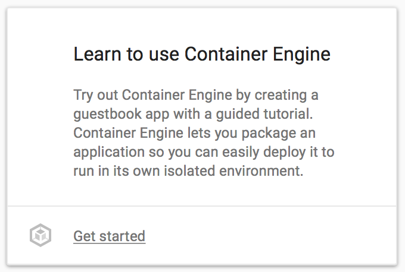
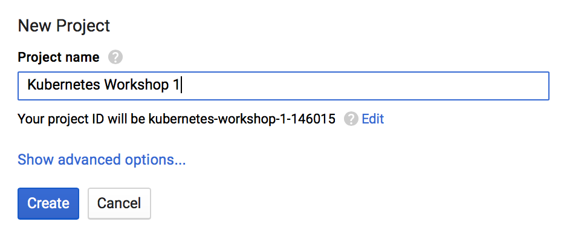
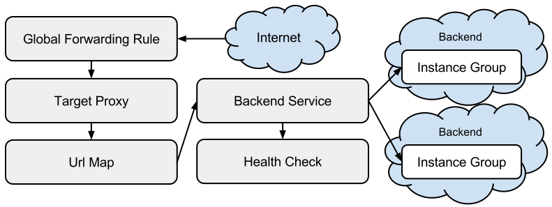

# Kubernetes Workshop - GCPUG

## Agenda

* Intro to Linux Containers & Container Orchestration
* Creating a Kubernetes cluster with Container Engine. (optionally a quick overview of Minikube for OSX)
* Overview of the sample application
* Creating container image
* Creating a deployment
* Configuring external load balancing.
* Connecting to the application.
* Scaling the the application.
* Rolling out an upgrade to the application.
* Troubleshooting the application (if time permits) 
* Reviewing the Logs & Monitoring the application (if time permits)
* Observe the Kubernetes Web UI. (if time permits)

## Intro to Linux Containers & Container Orchestration

### Linux Containers & Kubernetes Pods

### Container Orchestration

## Set Up

### Local machine

1. Get Docker
2. Get jq
3. Get minikube (?)
4. Clone this repository

### Create GCP Account

[Sign up here](https://cloud.google.com/free-trial/?utm_source=google&utm_medium=cpc&utm_campaign=2016-q3-cloud-japac-sg-gcp-bkws-freetrial&utm_content=en&gclid=CjwKEAjw97K_BRCwmNTK26iM-hMSJABrkNtbhQzsSBu8KNVGXKs-ZzuZOntLgsvB2elLa4XJWqb24RoCdcrw_wcB)

Note: GKE Tutorial

After clicking "More..." a Container Engine step through Tutorial is available:



### Download and Install the Google Cloud SDK

[Download and Install instructions](https://cloud.google.com/sdk/downloads)

Using Brew on OSX:
```
brew install Caskroom/cask/google-cloud-sdk
```

Optional: add auto completion by following instructions returned at end of brew installation.

### Initialize gcloud tools

Follow workflow in browser:
```
gcloud init
```

Optional: Learn more about [gcloud query and filtering features](https://cloudplatform.googleblog.com/2016/06/filtering-and-formatting-fun-with.html)

### Set Project

If you haven't created during init, create a new project via google console in [the browser](http://stackoverflow.com/questions/29212326/create-a-new-google-cloud-project-using-gcloud):



Get list of projects
```
gcloud projects list
```

Assuming you created the project starting with kubernetes, get the project id:
```
export project_id=`gcloud projects list --format="value(projectId)" --filter "name:kubernetes*" --limit=1`
```

Set the workshop project to the active configuration
```
gcloud config set project $project_id
```

### Enable Billing

* Option 1: [Via the browser](https://console.cloud.google.com/billing)

* Option 2: Via the console ( still in alpha at the time of writing - this will prompt you to install Alpha SDK components)

```
gcloud alpha billing accounts list
export account_id=`gcloud alpha billing accounts list --format="value(name.basename())" --limit=1`
gcloud alpha billing accounts projects link $project_id --account-id=$account_id
```

### Create a Container cluster

Note the [Available zones for GCP](https://cloud.google.com/compute/docs/regions-zones/regions-zones#available)

We'll use `asia-east1-a` for workshop

```
gcloud config set compute/zone asia-east1-a
```
Note: there is no validation on the correctness of the zone

Review information for clusters in `asia-east1-a`
```
gcloud container get-server-config
```

Create Cluster with defaults for all parameters:

```
gcloud container clusters create workshop --no-async
```
Highlight of parameter defaults:

* `--machine-type`: `n1-standard-1` (1 vCPU & 3.75GB memory)
* `--num-nodes`:  3 
* `--enbable-autoscaling`: off, when enabled - specify `--min-nodes` and `--max-nodes`
* `--image-type`:

  * `CONTAINER_VM`: Deprecated, debian 7 based images - Sysvinit resource manager
  * `GCI`: Google Container Image, chromium based - Systemd resource manager (Similar to CoreOS)
  
  Note: Oct 2016 - [Issues related to GCI](https://github.com/kubernetes/kubernetes/issues/34127) - if Glusterfs is required, use `--image-type container_vm`

See also [Full reference for `container clusters create` command](https://cloud.google.com/sdk/gcloud/reference/container/clusters/create)

Once the cluster command completed (takes about 5 minutes), verify all cluster listing:
```
gcloud container clusters list

# assuming you will use first cluster listed for remaining of workshop:
export cluster_name=`gcloud container clusters list --format="value(name.basename())" --limit=1`
```

Set cluster as the default:

```
gcloud config set container/cluster $cluster_name
```

Note: [Other Cluster Operations](https://cloud.google.com/container-engine/docs/clusters/operations)

### Install Kubectl

Either via Brew or gcloud:
```
gcloud components install kubectl
```

Get `kubectl` config
```
gcloud container clusters get-credentials $cluster_name
```
This will generate or update `~/.kube/config` with cluster info of the specified cluster

If prompted, enable your identity as a proxy for `kubectl` to call Google APIs:
```
gcloud beta auth application-default login
```
Note: [More details about & alternatives to this command](https://developers.google.com/identity/protocols/application-default-credentials)

You'll use `gcloud` to manage resources in your Google Cloud project and you'll use `kubectl` to manage resources within your Container Engine cluster. A single project can have multiple clusters, which makes it easy to have clusters that are made up of different machine types to satisfy different needs. When you create a cluster with gcloud it will automatically set up authentication for `kubectl`.

Review kubectl configuration and cluster info
```
kubectl config view | grep current
kubectl get no
kubectl cluster-info
```

Open Dashboard, use basic Auth credentials
```
gcloud container clusters describe $cluster_name --format="value(masterAuth.password)"
```

## Getting Familiar with creating & exposing Deployments

Deployments are a powerfull concept in Kubernetes. We will look at writing deployments manually later,
but to get familiar with the power of `kubectl`, lets do a few imperative operations without going to deep into the desired state definitions behind the scenes (Desired State is where the power for reproducability really lies).

A useful scenario for these commands would be to troubleshooting: for example: quickly run a shell in a pod for some in-cluster testing, or taking a faulty pod out of rotation and using a shell to investigate the cause of the failure without having production trafic routed to the containers.

### Deploying nginx proxy

As our first deployment, let's use the [official nginx image](https://hub.docker.com/_/nginx/)

```
kubectl run nginx --image=nginx:1.10-alpine --port=80
```
Note: We'll do a rolling update to version 1.11 later, so please use 1.10 (also, `latest` is not a version!)

Monitor the status of the deployment:
```
kubectl get po -w
```

To allow ingress traffic, we need to expose the nginx deployment as a NodePort on the cluster nodes:
```
kubectl expose deploy nginx --target-port=80 --type=NodePort
```
Note: Ingress works only if a [L7 Load Balancer controller](https://github.com/kubernetes/contrib/tree/master/ingress/controllers/gce) exists (`kubectl get -n kube-system rc -l k8s-app=glbc -o yaml`)

Get the nodePort assigned
```
kubectl get svc nginx -o=json | jq -r .spec.ports[].nodePort?
```

Expose nginx through a Basic Ingress
```
kubectl create -f part1/basic-ingress.yaml
```

[Reference](https://cloud.google.com/container-engine/docs/tutorials/http-balancer)
Note: This will take several minutes to provision following Gcloud resources:

[Global Forwarding Rule](https://cloud.google.com/compute/docs/load-balancing/http/global-forwarding-rules) -> [TargetHttpProxy](https://cloud.google.com/compute/docs/load-balancing/http/target-proxies) -> [Url Map](https://cloud.google.com/compute/docs/load-balancing/http/url-map) -> [Backend Service](https://cloud.google.com/compute/docs/load-balancing/http/backend-service) -> [Instance Group](https://cloud.google.com/compute/docs/instance-groups/) (our
cluster nodes)



First resources come up quickly, Bakend Service however can take up to 15 minutes before being healthy:
```
kubectl describe ing basic-ingress
gcloud compute forwarding-rules list
gcloud compute target-http-proxies list
gcloud compute url-maps list
gcloud compute backend-services list

 # wait for service to become Healthy

watch -n 1 gcloud compute backend-services get-health <k8s-be-...>
```

Note: [Link to Console](https://console.cloud.google.com/networking/loadbalancing/list)

```
export basic_ingress_ip=`kubectl get ing basic-ingress -o json | jq -r .status.loadBalancer.ingress[].ip`
open  http://$basic_ingress_ip/
```

### ConfigMaps

ConfigMaps allow us to store configuration within the Enviroment.
For demonstration purposes, let's put the index.html in the environment and mount it into the pods.

```
kubectl create configmap nginx-index --from-file part1/index.html
```


Mount index.html into running pod

Edit the deployment Manifest:
```diff
30a31,33
>         volumeMounts:
>          - name: nginx-index
>            mountPath: /usr/share/nginx/html/
36a40,46
>       volumes:
>        - name: nginx-index
>          configMap:
>            name: nginx-index
>            items:
>            - key: index.html
>              path: index.html
```

Use the provided example:
```
kubectl apply -f part1/nginx-index-mounted.yaml
```

```
while true; do curl -sL $basic_ingress_ip | grep -i title; sleep 1; done
```

### Scaling nginx

Watch the pod events:

```
kubectl get po -w
```

Scale the number of nginx instances
```
kubectl scale deploy nginx --replicas=3
```

### Changing Configurations propagate through cluster

Edit the configmap:

```
kubectl edit configmap nginx-index
```

Takes about 40 seconds for the new configuration values to propagate to all the pods

Note: You would not deploy new application versions this way, just configuration changes

### Rolling Update

Monitor the version deployed:
```
while true; do curl -sI $basic_ingress_ip | grep -i server; sleep 1; done
```

Monitor the Pod events
```
kubectl get po -w
```

Set the new image to the deployment
```
kubectl set image deployment/nginx nginx=nginx:1.11-alpine
```

## Overview of the sample application

### Microservices Demo

[Design](https://github.com/microservices-demo/microservices-demo/blob/master/docs/design.md)


## Building & Pushing a container Image

### Building Images locally

### Pushing Images to GCR

[Choose Registry](https://cloud.google.com/container-registry/docs/pushing?hl=en_US)
```
export registry=asia.gcr.io
```

Tag images:
```
docker tag nginx:1.10-alpine $registry/$project_id/nginx:1.10-alpine
```

Push images:
```
gcloud docker -- push $registry/$project_id/nginx:1.10-alpine
```
Note: `gcloud` does not work with [OSX Keychain](https://github.com/docker/docker-credential-helpers)

...

## Creating a Deployment

## Configuring External Load balancing

## Scaling the application

## Rolling out an upgrade to the application

## Cleaning Up


Delete container cluster
```
gcloud container clusters delete $cluster_name
```

## Additional Links

* [GKE Release Notes](https://cloud.google.com/container-engine/release-notes)
